# Marble Rush Arena

## 👥 Miembros del Equipo
| Nombre y Apellidos | Correo URJC | Usuario GitHub |
|:--- |:--- |:--- |
| Mario del Castillo Gómez | m.delcastillo.2023@alumnos.urjc.es | mdc1000 |
| Javier Simón Clemente | j.simon.2023@alumnos.urjc.es | javierSimc |
| Adrián Varea Fernández | a.varea.2023@alumnos.urjc.es | blodresg |
| Álvaro Gómez-Pimpollo García | al.gomezpimpoll.2023@alumnos.urjc.es | algomezpimpoll |
| Adrián Villalba Cuello de Oro | a.villalba.2023@alumnos.urjc.es| AdrianVillalba26 |

---

## 🎭 **Preparación 1: Definición del Proyecto**

### **Descripción del Tema**
Nuestra aplicación es un simulador de carreras de canicas. La idea es sencilla: Cada usuario registrado posee una o varias canicas, con la que puede competir en carreras que ocurren dentro de una serie de ligas. Cada participante de la carrera puede ver las posiciones finales de las carreras, junto a una puntuación. Todos los usuarios tienen acceso a un ranking global que muestra a los usuarios con más victorias/podios/puntos hasta el momento. 
En esta aplicación los usuarios también pueden dejar reseñas o comentarios acerca de una liga que hayan visto, pudiendo dejar un comentario y una valoración. Habrá un tipo de usuario sin registrar llamado invitado, que únicamente podrá visualizar las ligas y su contenido. El usuario administrador posee la capacidad de editar/borrar/añadir elementos a otros usuarios/entidades del sistema.
Se podrán filtrar las ligas en base a algunas configuraciones (por ejemplo por valoración, cantidad de comentarios, número de jugadores, etc).


### **Entidades**
1. **Perfil de Usuario**: Contiene un nombre y una contraseña asociada para poder registrarse. También contiene una imagen, su canica y una cifra de victorias y/o participaciones. Además, un usuario puede dejar comentarios o reseñas de una liga y puede tener como máximo 3 canicas, de las que podrá elegir una para participar en una liga o carrera.
2. **Canica**: uno de los elementos disponibles que tiene el usuario (máximo 3), que podrá usar en una carrera o liga. Tiene nombre, imagen/color (la de su usuario) y tamaño.
3. **Carrera**: Almacena las canicas participantes (máximo 8) y se autogestiona haciendo cálculos con números aleatorios para ver en qué posición termina cada canica.
4. **Liga**: Contiene un conjunto determinado de carreras en las que pueden participar los mismos usuarios hasta que finalice la última carrera.
5.  **Comentario**: Dentro de cada liga (en curso o terminada), los usuarios pueden dejar comentarios y una valoración asociada a la liga.

**>>>>> Por motivos de claridad, se asume que "Perfil de Usuario" y "Usuario" hacen referencia a la misma entidad. <<<<<**

**Relaciones entre entidades:**
- Usuario - Canica: Un usuario tiene hasta 3 canicas y cada canica pertenece a un usuario(1:N).
- Canica - Carrera: Una canica puede participar en varias carreras, y una carrera contiene varias canicas (N:M).
- Usuario - Comentario: Un usuario puede escribir varios comentarios y cada comentario pertenece a un usuario (1:N).
- Liga - Carrera: Cada liga tiene varias carreras y las carreras están asociadas a una liga (1:N).
- Liga - Comentario: Cada liga contiene múltiples comentarios y cada comentario pertenece a una liga (1:N).

### **Permisos de los Usuarios**
Describir los permisos de cada tipo de usuario e indicar de qué entidades es dueño:

* **Usuario invitado**: 
  - Permisos: Visualización de las ligas, ranking global, registro.
  - No es dueño de ninguna entidad.

* **Usuario Registrado**: 
  - Permisos: Gestión de perfil, gestión de canica, visualización del ranking global, participación en las ligas/carreras.
  - Es dueño de: Su canica, su propio perfil de usuario.

* **Administrador**: 
  - Permisos: Gestión completa de usuarios registrados y de sus canicas y perfiles, modificación de las carreras y las ligas, gestión del ranking global, visualización de estadísticas.
  - Es dueño de: Su propio perfil de usuario, las carreras y el ranking.

### **Imágenes**
Indicar qué entidades tendrán asociadas una o varias imágenes:

- **Usuario**: Una imagen de avatar por usuario.
- **Canica**: Una imagen por canica (distinta a la imagen de usuario).

### **Gráficos**
Indicar qué información se mostrará usando gráficos y de qué tipo serán:

- **Registro  de carreras ganadas y perdidas**: Cada usuario puede acceder a un gráfico propio que le indica las veces que ha ganado y que ha perdido - Gráfico de tarta / circular.
- **Registro  de partidas por día**: Cada usuario puede acceder a un gráfico propio que le indica en cuántas carreras ha participado cada día - Gráfico de columnas.

### **Tecnología Complementaria**
Indicar qué tecnología complementaria se empleará:

- Correos electrónicos para confirmar el registro a la web.
- Creación de PDF con la información de una liga al finalizar.

### **Algoritmo o Consulta Avanzada**
Indicar cuál será el algoritmo o consulta avanzada que se implementará:

- **Algoritmo/Consulta**: Filtrar las ligas por número de comentarios o valoración total.
- **Descripción**: Contabiliza los comentarios asociados a cada liga y hace una media de la valoración de todos los comentarios, luego los ordena de mayor a menor y viceversa.
- **Alternativa**: Se pueden hacer otro tipo de filtrados por ejemplo por número de usuarios.

---

## 🛠 **Preparación 2: Maquetación de páginas con HTML y CSS**

### **Vídeo de Demostración**
📹 **[Enlace al vídeo en YouTube](https://www.youtube.com/watch?v=VHPdEEs-Ov4)**
> Vídeo mostrando las principales funcionalidades de la aplicación web.

### **Diagrama de Navegación**
Diagrama que muestra cómo se navega entre las diferentes páginas de la aplicación:


> [Descripción opcional del flujo de navegación: Ej: "El usuario puede acceder desde la página principal a todas las secciones mediante el menú de navegación. Los usuarios anónimos solo tienen acceso a las páginas públicas, mientras que los registrados pueden acceder a su perfil y panel de usuario."]

### **Capturas de Pantalla y Descripción de Páginas**

<b>- En todas las pantallas hay una barra oscura con botones azules en la que se muestran opciones disponibles que el usuario puede realizar, aunque pueden variar o cambiar dependiendo del tipo de usuario y/o pantalla. </b>

#### **1. Página Principal / Home**
<b>- En modo usuario anónimo</b>
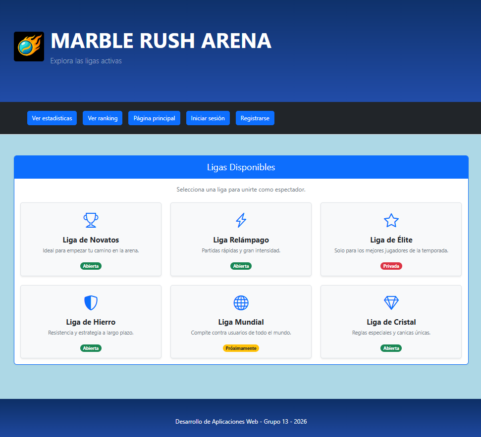

<b>Descripción: </b> Página que se le muestra al usuario anónimo o invitado al entrar a la aplicación web. En ella, se muestran las ligas a las que se pueden acceder.

<b>- En modo usuario registrado</b>
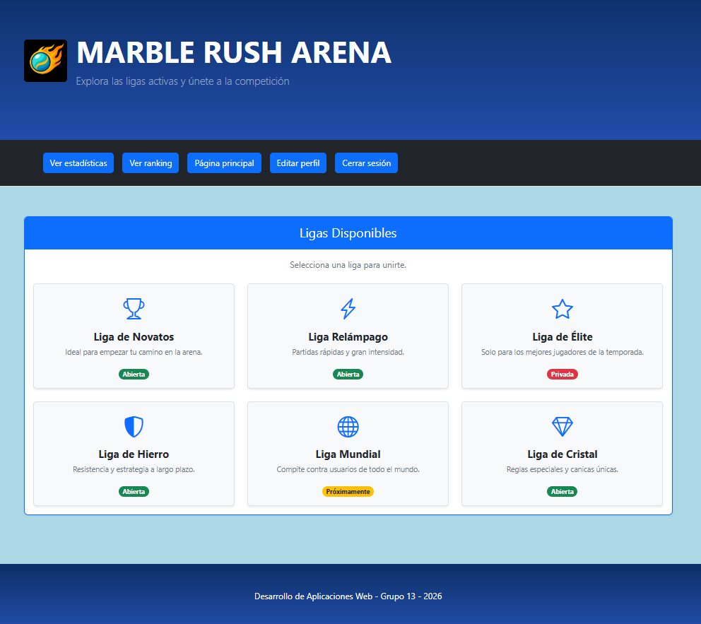

<b>Descripción: </b> Página que se le muestra al usuario registrado al entrar a la aplicación web. En ella, se muestran las ligas a las que puede entrar para participar. 
 
<b>- En modo usuario administrador </b>
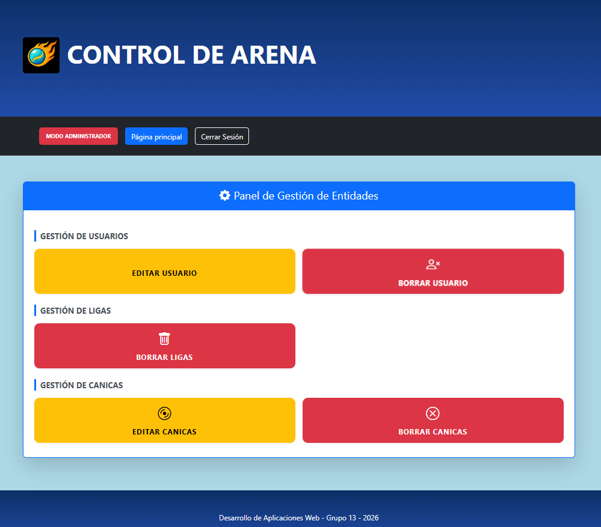

<b>Descripción: </b> Página que se le muestra al usuario administrador al entrar a la aplicación web. En ella, se muestran las diferentes opciones que el administrador tiene disponible para gestionar los usuarios, las ligas o las canicas.

#### **2. Página del formulario de inicio de sesión**
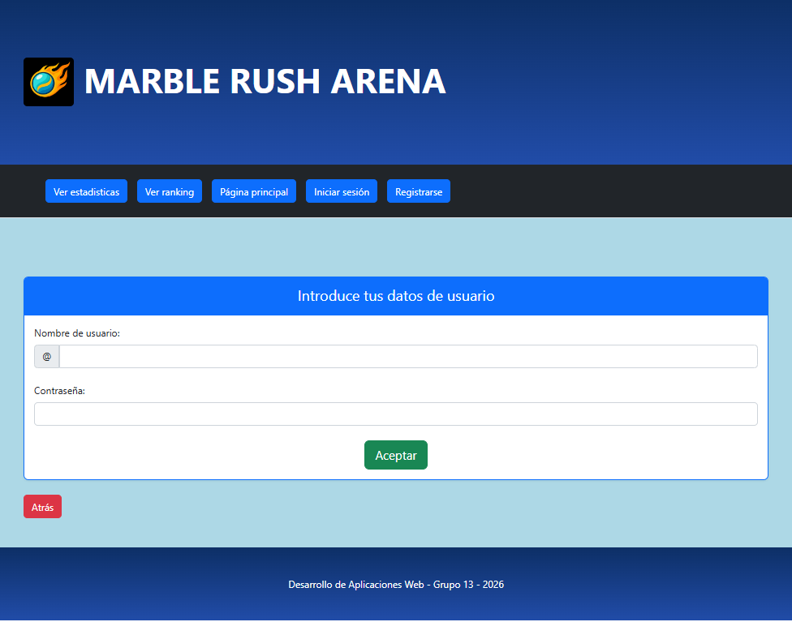

<b>Descripción: </b> Página que muestra un formulario en el que el hay que introducir un nombre de usuario y una contraseña para poder iniciar sesión en la aplicación web. 

#### **3. Página del formulario de registro**
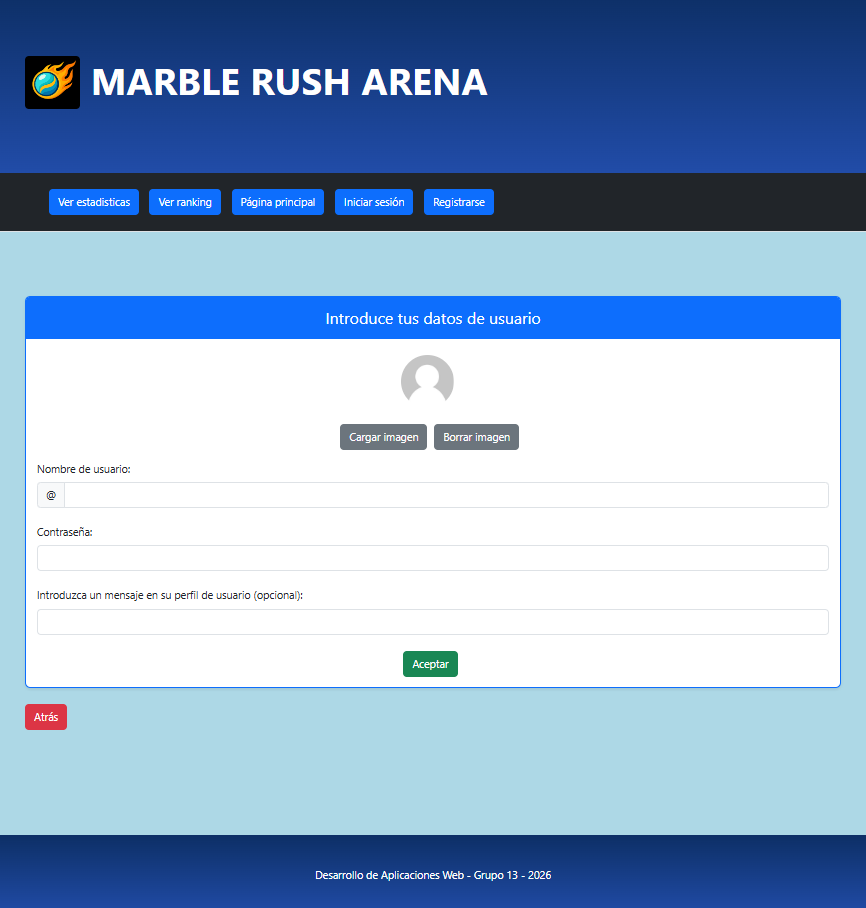

<b>Descripción: </b> Si es la primera vez que el usuario inicia sesión en la aplicación web, podrá acceder a esta página en la que se le mostrará un formulario de registro. En él, tendrá que introducir sus datos personales (nombre de usuario y contraseña), y opcionalmente, podrá incluir un mensaje que saldrá en su perfil, además de decidir si quiere ponerse una foto de perfil o no. 

#### **4. Página del ranking**
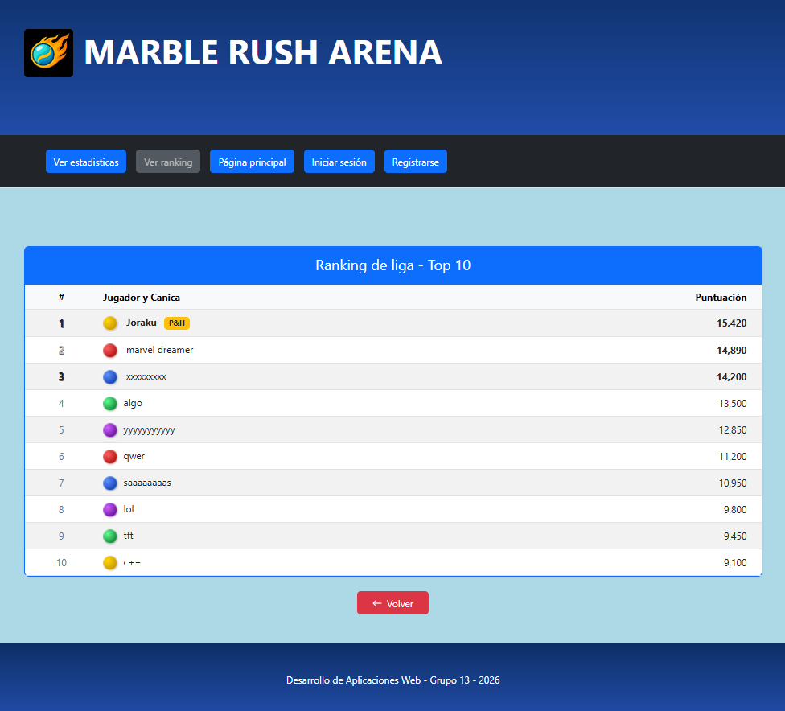

<b>Descripción: </b> Página que muestra un ranking con las diferentes posiciones o puestos actuales de los 10 usuarios con la puntuación más alta de todos los que han jugado en la aplicación. En él, además de los puestos, se puede ver el nombre y la canica de cada jugador, así como la puntuación obtenida de cada uno. 

#### **5. Página de selección de canica**
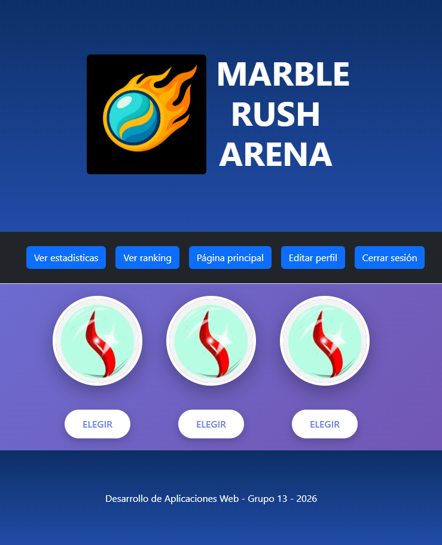

<b>Descripción: </b> Página que muestra la pantalla de selección de una canica, en la que se debe elegir una canica de las que el usuario tiene disponibles para poder participar en una carrera.

#### **6. Página de una carrera**
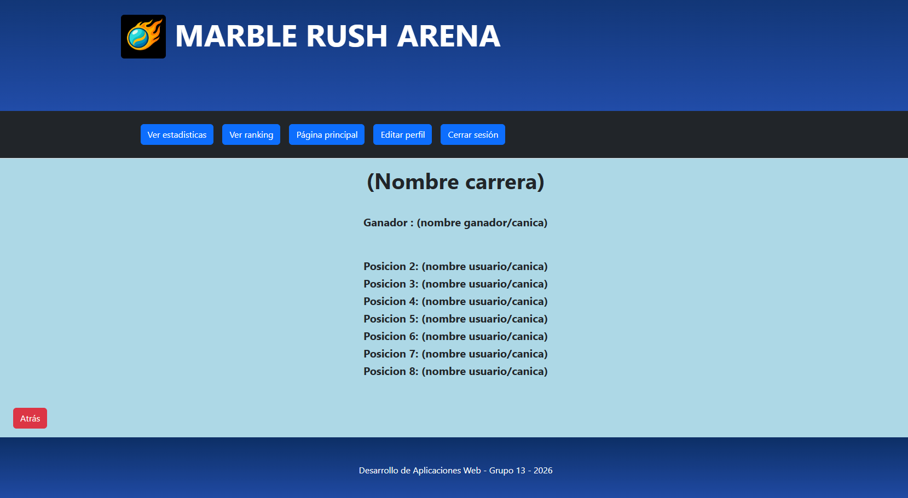

<b>Descripción: </b> Página que muestra los resultados obtenidos tras haber realizado una carrera (las carreras son instántaneas, por lo que se realizan al momento y se muestran directamente los resultados cada vez que se accede a una).

#### **7. Página de una liga**
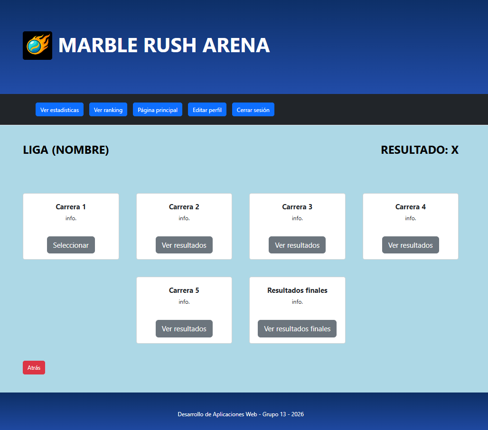

<b>Descripción: </b> Página en la que se muestra el contenido de una liga previamente seleccionada. En esta página, se pueden ver el total de carreras que tiene la liga, acceder a cada carrera para comprobar los resultados obtenidos en cada una, y visualizar los resultados finales globales de la liga. También se puede ver el nombre de la liga a la que se ha accedido además de tu resultado obtenido tras haber jugado en ella.

#### **8. Página de creación o modificación de una liga**
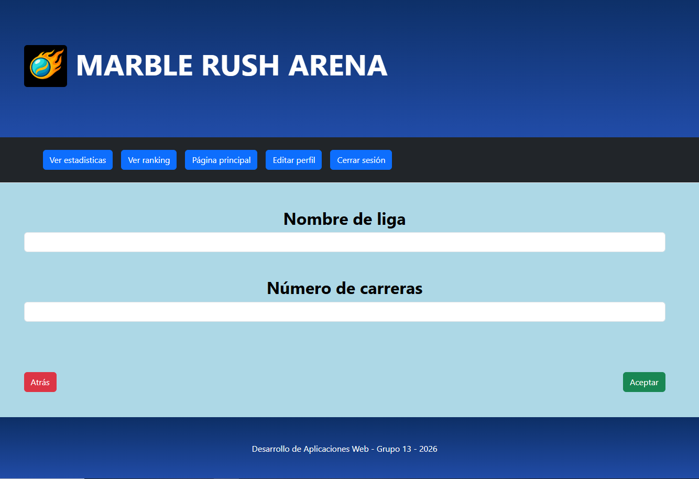

<b>Descripción: </b> Página en la que se muestra los campos que hay que rellenar (nombre y número de carreras) para poder crear una nueva liga o para actualizar dichos datos por los introducidos en caso de que se modifique una liga.

#### **9. Página de selección de un usuario**
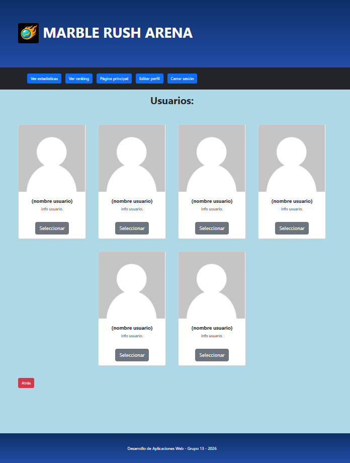

<b>Descripción: </b> Página en la que se muestra una lista con los usuarios que han accedido a la aplicación web, de manera que se tiene la opción de seleccionar a uno de ellos.

#### **10. Página de selección de una liga**


<b>Descripción: </b> Página en la que se muestra una lista con las ligas que tiene la aplicación web, de manera que se puede seleccionar una de ellas.

#### **11. Página de visualización de estadísticas**
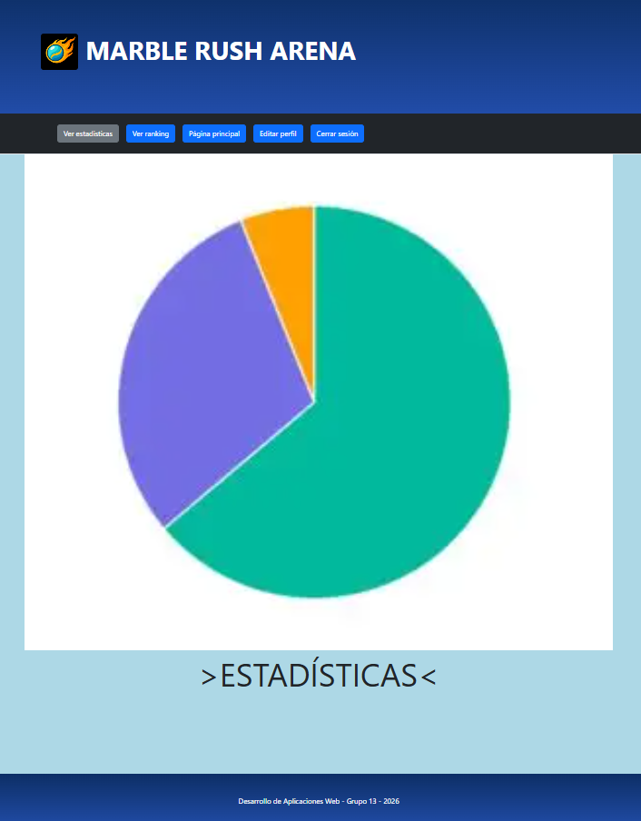

<b>Descripción: </b> Página que muestra una serie de gráficos a los que el usuario puede acceder para consultar sus estadísticas.

#### **12. Página de edición de usuario**
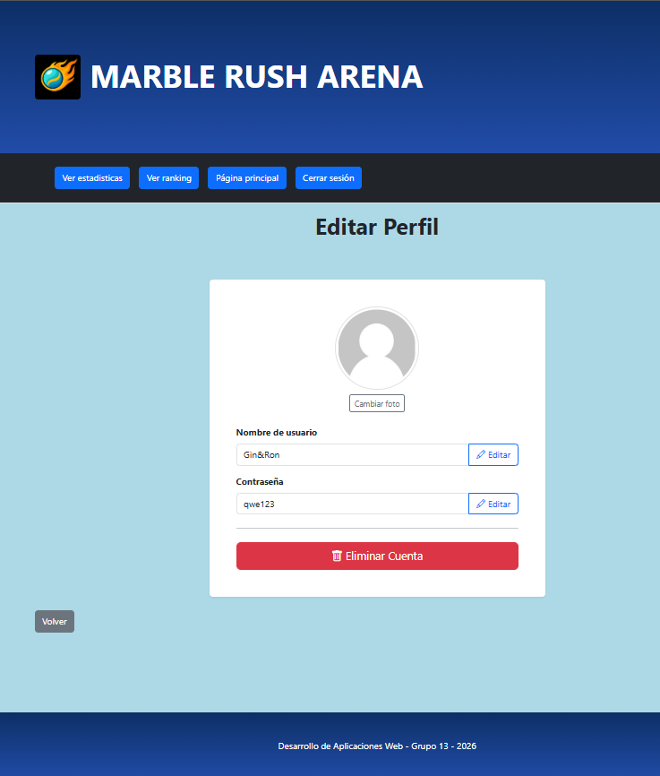

<b>Descripción: </b> Página que muestra los atributos de un usuario con la opción de poder editar la información.

#### **13. Página de edición de canica**
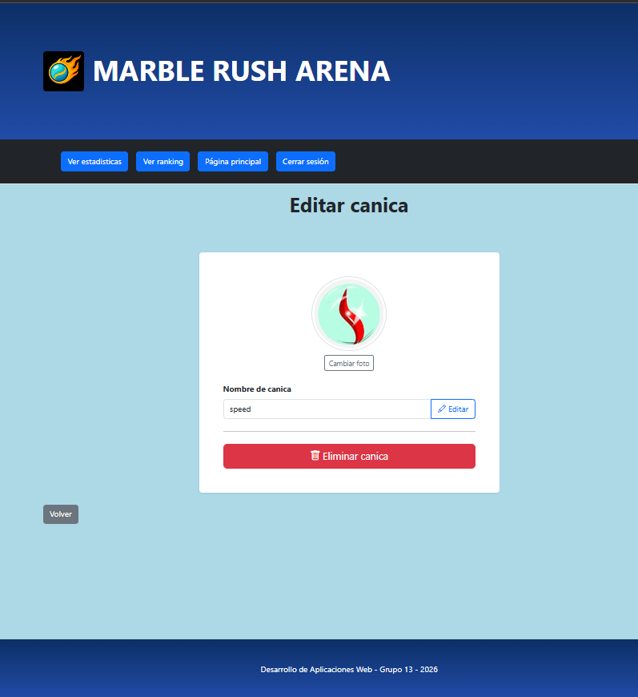

<b>Descripción: </b> Página que muestra los atributos de una canica con la opción de poder editar la información.

---

## 🛠 **Práctica 1: Web con HTML generado en servidor y AJAX**

### **Vídeo de Demostración**
📹 **[Enlace al vídeo en YouTube](https://www.youtube.com/watch?v=x91MPoITQ3I)**
> Vídeo mostrando las principales funcionalidades de la aplicación web.

### **Navegación y Capturas de Pantalla**

#### **Diagrama de Navegación**

Solo si ha cambiado.

#### **Capturas de Pantalla Actualizadas**

Solo si han cambiado.

### **Instrucciones de Ejecución**

#### **Requisitos Previos**
- **Java**: versión 21 o superior
- **Maven**: versión 3.8 o superior
- **MySQL**: versión 8.0 o superior
- **Git**: para clonar el repositorio

#### **Pasos para ejecutar la aplicación**

1. **Clonar el repositorio**
   ```bash
   git clone https://github.com/[usuario]/[nombre-repositorio].git
   cd [nombre-repositorio]
   ```

2. **AQUÍ INDICAR LO SIGUIENTES PASOS**

#### **Credenciales de prueba**
- **Usuario Admin**: usuario: `admin`, contraseña: `admin`
- **Usuario Registrado**: usuario: `user`, contraseña: `user`

### **Diagrama de Entidades de Base de Datos**

Diagrama mostrando las entidades, sus campos y relaciones:


> [Descripción opcional: Ej: "El diagrama muestra las 4 entidades principales: Usuario, Producto, Pedido y Categoría, con sus respectivos atributos y relaciones 1:N y N:M."]

### **Diagrama de Clases y Templates**

Diagrama de clases de la aplicación con diferenciación por colores o secciones:


> [Descripción opcional del diagrama y relaciones principales]

### **Participación de Miembros en la Práctica 1**

#### **Alumno 1 - [Nombre Completo]**

[Descripción de las tareas y responsabilidades principales del alumno en el proyecto]

| Nº    | Commits      | Files      |
|:------------: |:------------:| :------------:|
|1| [Descripción commit 1](URL_commit_1)  | [Archivo1](URL_archivo_1)   |
|2| [Descripción commit 2](URL_commit_2)  | [Archivo2](URL_archivo_2)   |
|3| [Descripción commit 3](URL_commit_3)  | [Archivo3](URL_archivo_3)   |
|4| [Descripción commit 4](URL_commit_4)  | [Archivo4](URL_archivo_4)   |
|5| [Descripción commit 5](URL_commit_5)  | [Archivo5](URL_archivo_5)   |

---

#### **Alumno 2 - [Nombre Completo]**

[Descripción de las tareas y responsabilidades principales del alumno en el proyecto]

| Nº    | Commits      | Files      |
|:------------: |:------------:| :------------:|
|1| [Descripción commit 1](URL_commit_1)  | [Archivo1](URL_archivo_1)   |
|2| [Descripción commit 2](URL_commit_2)  | [Archivo2](URL_archivo_2)   |
|3| [Descripción commit 3](URL_commit_3)  | [Archivo3](URL_archivo_3)   |
|4| [Descripción commit 4](URL_commit_4)  | [Archivo4](URL_archivo_4)   |
|5| [Descripción commit 5](URL_commit_5)  | [Archivo5](URL_archivo_5)   |

---

#### **Alumno 3 - [Nombre Completo]**

[Descripción de las tareas y responsabilidades principales del alumno en el proyecto]

| Nº    | Commits      | Files      |
|:------------: |:------------:| :------------:|
|1| [Descripción commit 1](URL_commit_1)  | [Archivo1](URL_archivo_1)   |
|2| [Descripción commit 2](URL_commit_2)  | [Archivo2](URL_archivo_2)   |
|3| [Descripción commit 3](URL_commit_3)  | [Archivo3](URL_archivo_3)   |
|4| [Descripción commit 4](URL_commit_4)  | [Archivo4](URL_archivo_4)   |
|5| [Descripción commit 5](URL_commit_5)  | [Archivo5](URL_archivo_5)   |

---

#### **Alumno 4 - [Nombre Completo]**

[Descripción de las tareas y responsabilidades principales del alumno en el proyecto]

| Nº    | Commits      | Files      |
|:------------: |:------------:| :------------:|
|1| [Descripción commit 1](URL_commit_1)  | [Archivo1](URL_archivo_1)   |
|2| [Descripción commit 2](URL_commit_2)  | [Archivo2](URL_archivo_2)   |
|3| [Descripción commit 3](URL_commit_3)  | [Archivo3](URL_archivo_3)   |
|4| [Descripción commit 4](URL_commit_4)  | [Archivo4](URL_archivo_4)   |
|5| [Descripción commit 5](URL_commit_5)  | [Archivo5](URL_archivo_5)   |

---

## 🛠 **Práctica 2: Incorporación de una API REST a la aplicación web, despliegue con Docker y despliegue remoto**

### **Vídeo de Demostración**
📹 **[Enlace al vídeo en YouTube](https://www.youtube.com/watch?v=x91MPoITQ3I)**
> Vídeo mostrando las principales funcionalidades de la aplicación web.

### **Documentación de la API REST**

#### **Especificación OpenAPI**
📄 **[Especificación OpenAPI (YAML)](/api-docs/api-docs.yaml)**

#### **Documentación HTML**
📖 **[Documentación API REST (HTML)](https://raw.githack.com/[usuario]/[repositorio]/main/api-docs/api-docs.html)**

> La documentación de la API REST se encuentra en la carpeta `/api-docs` del repositorio. Se ha generado automáticamente con SpringDoc a partir de las anotaciones en el código Java.

### **Diagrama de Clases y Templates Actualizado**

Diagrama actualizado incluyendo los @RestController y su relación con los @Service compartidos:


### **Instrucciones de Ejecución con Docker**

#### **Requisitos previos:**
- Docker instalado (versión 20.10 o superior)
- Docker Compose instalado (versión 2.0 o superior)

#### **Pasos para ejecutar con docker-compose:**

1. **Clonar el repositorio** (si no lo has hecho ya):
   ```bash
   git clone https://github.com/[usuario]/[repositorio].git
   cd [repositorio]
   ```

2. **AQUÍ LOS SIGUIENTES PASOS**:

### **Construcción de la Imagen Docker**

#### **Requisitos:**
- Docker instalado en el sistema

#### **Pasos para construir y publicar la imagen:**

1. **Navegar al directorio de Docker**:
   ```bash
   cd docker
   ```

2. **AQUÍ LOS SIGUIENTES PASOS**

### **Despliegue en Máquina Virtual**

#### **Requisitos:**
- Acceso a la máquina virtual (SSH)
- Clave privada para autenticación
- Conexión a la red correspondiente o VPN configurada

#### **Pasos para desplegar:**

1. **Conectar a la máquina virtual**:
   ```bash
   ssh -i [ruta/a/clave.key] [usuario]@[IP-o-dominio-VM]
   ```
   
   Ejemplo:
   ```bash
   ssh -i ssh-keys/app.key vmuser@10.100.139.XXX
   ```

2. **AQUÍ LOS SIGUIENTES PASOS**:

### **URL de la Aplicación Desplegada**

🌐 **URL de acceso**: `https://[nombre-app].etsii.urjc.es:8443`

#### **Credenciales de Usuarios de Ejemplo**

| Rol | Usuario | Contraseña |
|:---|:---|:---|
| Administrador | admin | admin123 |
| Usuario Registrado | user1 | user123 |
| Usuario Registrado | user2 | user123 |

### **Participación de Miembros en la Práctica 2**

#### **Alumno 1 - [Nombre Completo]**

[Descripción de las tareas y responsabilidades principales del alumno en el proyecto]

| Nº    | Commits      | Files      |
|:------------: |:------------:| :------------:|
|1| [Descripción commit 1](URL_commit_1)  | [Archivo1](URL_archivo_1)   |
|2| [Descripción commit 2](URL_commit_2)  | [Archivo2](URL_archivo_2)   |
|3| [Descripción commit 3](URL_commit_3)  | [Archivo3](URL_archivo_3)   |
|4| [Descripción commit 4](URL_commit_4)  | [Archivo4](URL_archivo_4)   |
|5| [Descripción commit 5](URL_commit_5)  | [Archivo5](URL_archivo_5)   |

---

#### **Alumno 2 - [Nombre Completo]**

[Descripción de las tareas y responsabilidades principales del alumno en el proyecto]

| Nº    | Commits      | Files      |
|:------------: |:------------:| :------------:|
|1| [Descripción commit 1](URL_commit_1)  | [Archivo1](URL_archivo_1)   |
|2| [Descripción commit 2](URL_commit_2)  | [Archivo2](URL_archivo_2)   |
|3| [Descripción commit 3](URL_commit_3)  | [Archivo3](URL_archivo_3)   |
|4| [Descripción commit 4](URL_commit_4)  | [Archivo4](URL_archivo_4)   |
|5| [Descripción commit 5](URL_commit_5)  | [Archivo5](URL_archivo_5)   |

---

#### **Alumno 3 - [Nombre Completo]**

[Descripción de las tareas y responsabilidades principales del alumno en el proyecto]

| Nº    | Commits      | Files      |
|:------------: |:------------:| :------------:|
|1| [Descripción commit 1](URL_commit_1)  | [Archivo1](URL_archivo_1)   |
|2| [Descripción commit 2](URL_commit_2)  | [Archivo2](URL_archivo_2)   |
|3| [Descripción commit 3](URL_commit_3)  | [Archivo3](URL_archivo_3)   |
|4| [Descripción commit 4](URL_commit_4)  | [Archivo4](URL_archivo_4)   |
|5| [Descripción commit 5](URL_commit_5)  | [Archivo5](URL_archivo_5)   |

---

#### **Alumno 4 - [Nombre Completo]**

[Descripción de las tareas y responsabilidades principales del alumno en el proyecto]

| Nº    | Commits      | Files      |
|:------------: |:------------:| :------------:|
|1| [Descripción commit 1](URL_commit_1)  | [Archivo1](URL_archivo_1)   |
|2| [Descripción commit 2](URL_commit_2)  | [Archivo2](URL_archivo_2)   |
|3| [Descripción commit 3](URL_commit_3)  | [Archivo3](URL_archivo_3)   |
|4| [Descripción commit 4](URL_commit_4)  | [Archivo4](URL_archivo_4)   |
|5| [Descripción commit 5](URL_commit_5)  | [Archivo5](URL_archivo_5)   |

---

## 🛠 **Práctica 3: Implementación de la web con arquitectura SPA**

### **Vídeo de Demostración**
📹 **[Enlace al vídeo en YouTube](URL_del_video)**
> Vídeo mostrando las principales funcionalidades de la aplicación web.

### **Preparación del Entorno de Desarrollo**

#### **Requisitos Previos**
- **Node.js**: versión 18.x o superior
- **npm**: versión 9.x o superior (se instala con Node.js)
- **Git**: para clonar el repositorio

#### **Pasos para configurar el entorno de desarrollo**

1. **Instalar Node.js y npm**
   
   Descarga e instala Node.js desde [https://nodejs.org/](https://nodejs.org/)
   
   Verifica la instalación:
   ```bash
   node --version
   npm --version
   ```

2. **Clonar el repositorio** (si no lo has hecho ya)
   ```bash
   git clone https://github.com/[usuario]/[nombre-repositorio].git
   cd [nombre-repositorio]
   ```

3. **Navegar a la carpeta del proyecto React**
   ```bash
   cd frontend
   ```

4. **AQUÍ LOS SIGUIENTES PASOS**

### **Diagrama de Clases y Templates de la SPA**

Diagrama mostrando los componentes React, hooks personalizados, servicios y sus relaciones:


### **Participación de Miembros en la Práctica 3**

#### **Alumno 1 - [Nombre Completo]**

[Descripción de las tareas y responsabilidades principales del alumno en el proyecto]

| Nº    | Commits      | Files      |
|:------------: |:------------:| :------------:|
|1| [Descripción commit 1](URL_commit_1)  | [Archivo1](URL_archivo_1)   |
|2| [Descripción commit 2](URL_commit_2)  | [Archivo2](URL_archivo_2)   |
|3| [Descripción commit 3](URL_commit_3)  | [Archivo3](URL_archivo_3)   |
|4| [Descripción commit 4](URL_commit_4)  | [Archivo4](URL_archivo_4)   |
|5| [Descripción commit 5](URL_commit_5)  | [Archivo5](URL_archivo_5)   |

---

#### **Alumno 2 - [Nombre Completo]**

[Descripción de las tareas y responsabilidades principales del alumno en el proyecto]

| Nº    | Commits      | Files      |
|:------------: |:------------:| :------------:|
|1| [Descripción commit 1](URL_commit_1)  | [Archivo1](URL_archivo_1)   |
|2| [Descripción commit 2](URL_commit_2)  | [Archivo2](URL_archivo_2)   |
|3| [Descripción commit 3](URL_commit_3)  | [Archivo3](URL_archivo_3)   |
|4| [Descripción commit 4](URL_commit_4)  | [Archivo4](URL_archivo_4)   |
|5| [Descripción commit 5](URL_commit_5)  | [Archivo5](URL_archivo_5)   |

---

#### **Alumno 3 - [Nombre Completo]**

[Descripción de las tareas y responsabilidades principales del alumno en el proyecto]

| Nº    | Commits      | Files      |
|:------------: |:------------:| :------------:|
|1| [Descripción commit 1](URL_commit_1)  | [Archivo1](URL_archivo_1)   |
|2| [Descripción commit 2](URL_commit_2)  | [Archivo2](URL_archivo_2)   |
|3| [Descripción commit 3](URL_commit_3)  | [Archivo3](URL_archivo_3)   |
|4| [Descripción commit 4](URL_commit_4)  | [Archivo4](URL_archivo_4)   |
|5| [Descripción commit 5](URL_commit_5)  | [Archivo5](URL_archivo_5)   |

---

#### **Alumno 4 - [Nombre Completo]**

[Descripción de las tareas y responsabilidades principales del alumno en el proyecto]

| Nº    | Commits      | Files      |
|:------------: |:------------:| :------------:|
|1| [Descripción commit 1](URL_commit_1)  | [Archivo1](URL_archivo_1)   |
|2| [Descripción commit 2](URL_commit_2)  | [Archivo2](URL_archivo_2)   |
|3| [Descripción commit 3](URL_commit_3)  | [Archivo3](URL_archivo_3)   |
|4| [Descripción commit 4](URL_commit_4)  | [Archivo4](URL_archivo_4)   |
|5| [Descripción commit 5](URL_commit_5)  | [Archivo5](URL_archivo_5)   |

